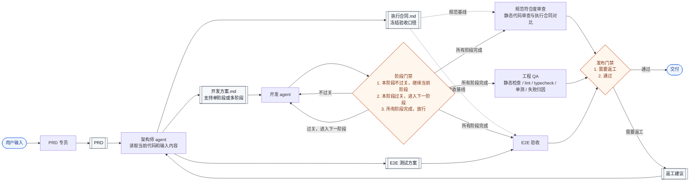

# Harness Engineering Flow

这张图表达的是一个完全自治的 harness engineering 闭环：

- 用户只在起点输入需求，之后从规划到交付都不需要人类介入。
- `PRD` 是原始输入，不直接充当后续所有 agent 的统一判定基线。
- `架构师 agent` 先把 `PRD` 收敛成一份冻结的 `执行合同.md`，再输出 `开发方案.md` 与 `E2E 测试方案`。
- 从规划完成开始，`执行合同.md` 成为 `开发 agent`、`规范符合度审查`、`E2E 验收` 共享的唯一需求口径；后续 agent 不再各自自由解释 `PRD`。
- `开发 agent` 只执行当前阶段；阶段不通过时继续当前阶段，通过后进入下一阶段，直到全部完成。
- 任一发布门禁不通过时，返工建议不会直接交给开发，而是回流给 `架构师 agent` 重新规划。

## 概念定义

- `执行合同.md` 是架构阶段冻结的结构化执行规格，用来把 `PRD` 里的产品语言、模糊表述和开放问题，收敛成后续可实现、可审查、可验收的明确条目。
- `执行合同.md` 至少应明确：交付范围、非目标、页面 / 路由 / API / 数据持久化等显式交付项、关键交互、边界条件、验收标准，以及因 `PRD` 歧义而采用的显式假设。
- 如果 `PRD` 存在模糊点，必须先在 `执行合同.md` 中转化为明确假设或约束；后续 agent 只能按合同执行，不能各自二次解释。
- `规范符合度审查` 指静态代码审查与 `执行合同.md` 对比，关注“是否做了、是否做全了、是否和冻结后的需求口径一致”。
- 典型检查包括：`执行合同.md` 要求有 5 个页面，但代码里只发现 4 个路由；`执行合同.md` 要求拖拽交互，但代码里没有对应组件或交互实现；`执行合同.md` 要求本地持久化，但代码里未发现存储实现。
- `E2E 测试方案` 负责把 `执行合同.md` 中的关键验收条目映射为端到端场景，避免每次验收都重新解释原始 `PRD`。
- `工程 QA` 负责工程质量与测试闭环，包含静态检查、`lint`、`typecheck`、单元测试、测试补全、失败归因。
- `工程 QA` 的关注点不是“需求是否齐全”，而是“实现是否稳定、可验证、失败原因是否可定位”。
