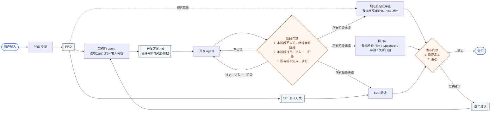

# Harness Engineering Flow

这张图表达的是一个完全自治的 harness engineering 闭环：

- 用户只在起点输入需求，之后从规划到交付都不需要人类介入。
- `PRD` 既驱动架构规划，也产出 `E2E 测试方案`，并作为规范审查的基线。
- `架构师 agent` 负责输出 `开发方案.md`，可以是一阶段，也可以拆成多阶段。
- `开发 agent` 只执行当前阶段；阶段不通过时继续当前阶段，通过后进入下一阶段，直到全部完成。
- 任一发布门禁不通过时，返工建议不会直接交给开发，而是回流给 `架构师 agent` 重新规划。

## 概念定义

- `规范符合度审查` 指静态代码审查与 `PRD` 对比，关注“是否做了、是否做全了、是否和需求一致”。
- 典型检查包括：`PRD` 要求有 5 个页面，但代码里只发现 4 个路由；`PRD` 要求拖拽交互，但代码里没有对应组件或交互实现；`PRD` 要求本地持久化，但代码里未发现存储实现。
- `工程 QA` 负责工程质量与测试闭环，包含静态检查、`lint`、`typecheck`、单元测试、测试补全、失败归因。
- `工程 QA` 的关注点不是“需求是否齐全”，而是“实现是否稳定、可验证、失败原因是否可定位”。
