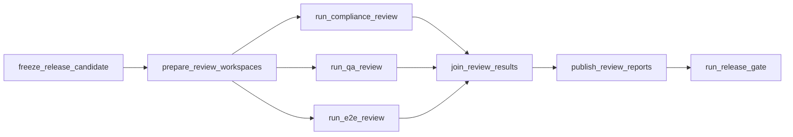

# V1 实现设计

## 文档状态

- 状态：已定稿，作为 `v1` 的实现基线
- 目标：把 [v1-runtime-architecture.md](/Users/laysath/proj/autogen/docs/v1-runtime-architecture.md) 与 [v1-simulated-run.md](/Users/laysath/proj/autogen/docs/v1-simulated-run.md) 里的运行约束，落成可直接实施的工程设计
- 适用范围：`orchestrator`、共享 workspace、执行容器、git 工作流、仓库内工件、阶段循环、发布循环、并发验证、异常恢复
- 读者：后续负责实现 `v1` 的 Codex 线程 / 开发者

---

## 1. 设计目标

### 1.1 V1 要解决的问题

`v1` 的目标不是做出最终形态的全功能自治平台，而是先把一个最小但真实的软件交付闭环跑通，并保证它具备以下特征：

1. 输入最小化，只接受：
   - `prd_markdown`
   - `github_repo_url`
2. 全流程围绕真实仓库与真实容器执行，而不是纯文本模拟。
3. 开发阶段保留现场：
   - `开发 agent`
   - `阶段门禁 agent`
   在同一阶段共享同一个开发容器和同一个工作区。
4. 发布阶段支持三路验证并行：
   - `规范符合度审查`
   - `工程 QA`
   - `E2E 验收`
5. 所有流程工件写入目标仓库，并由 git 跟踪。
6. 发布失败后进入新的 `cycle`，重新规划，而不是在旧上下文里继续乱修。

### 1.2 V1 不追求的内容

`v1` 明确不做以下事情：

1. 不在执行容器内安装完整 agent runtime。
2. 不追求第一版就支持多语言、多包管理器、多云 provider 的完全通用性。
3. 不追求复杂分布式恢复。
4. 不追求把 prompt、权限、模型、运行图都做成完全可插拔平台。
5. 不追求第一版就支持多个开发阶段并发修改同一个 `run_branch`。

---

## 2. 总体架构定案

## 2.1 分层

`v1` 固定采用两层架构：

1. 顶层编排：`LangGraph`
2. 角色执行：运行在 `orchestrator` 进程内的角色 agent / role runner

其中：

- `LangGraph` 负责：
  - 状态流转
  - 条件分支
  - 循环
  - 失败回流
  - 可恢复状态
- 角色执行层负责：
  - 按角色 system prompt 完成任务
  - 调用受限工具
  - 产出代码、工件、检查结论

## 2.2 执行容器中的约束

执行容器只承担“真实执行环境”的职责，不承担“agent runtime”的职责。也就是说：

- 执行容器里不跑单独的 Deep Agents 进程
- 执行容器里不跑单独的 orchestrator 子进程
- 执行容器里不直接持有 Docker socket
- 执行容器只提供：
  - 文件系统视图 `/workspace`
  - git/ssh
  - 项目依赖运行环境
  - 测试 / 构建 / Playwright 等真实命令环境

## 2.3 控制面 / 执行面职责边界

### 控制面：`orchestrator`

负责：

- 读取输入
- 创建 `run_id`
- 创建 `run_branch`
- 创建 / 销毁工作区
- 创建 / 销毁容器
- 运行 `LangGraph`
- 运行角色 agent
- 控制角色权限
- 代理文件系统工具
- 代理 `docker exec`
- 串行执行所有 `push`
- 保存编排器私有状态

### 执行面：开发 / 验证容器

负责：

- clone 仓库
- checkout 对应分支 / 提交
- 运行 `git` / `bun` / `npm` / `pytest` / `playwright` / `lint` / `typecheck`
- 运行真实程序与测试

---

## 3. 不可变运行约束

以下约束属于 `v1` 的硬约束，后续实现不得擅自改变。

### 3.1 `/workspace` 永远等于目标仓库根目录

这是整个 `v1` 的核心约束之一。

对任意执行容器：

- `/workspace/.git` 必须存在
- `/workspace` 必须是 repo root
- `/workspace/.autogen` 必须位于仓库内

禁止出现以下布局：

```text
/workspace/
  repo/
    .git/
```

正确布局必须是：

```text
/workspace/
  .git/
  src/
  ...
  .autogen/
```

### 3.2 角色看到的文件系统世界只有 `/workspace`

对执行角色来说：

- 只能使用 `/workspace/...` 路径
- 不应感知宿主机路径
- 不应感知 `orchestrator` 容器内的 backing path

### 3.3 所有运行工件都写入仓库内 `.autogen`

仓库内可审计工件统一放在：

```text
/workspace/.autogen/runs/<run_id>/
```

编排器私有状态不放这里，统一放仓库外：

```text
${AUTOGEN_WORKSPACE_ROOT}/_state/
```

### 3.4 只有 `orchestrator` 可以控制 Docker

- 只有 `orchestrator` 挂载 Docker socket
- 执行容器不得直接控制 sibling containers

### 3.5 所有 `push` 必须串行

无论开发阶段还是发布阶段：

- 实际推送到远端的动作必须串行
- 串行是由 `orchestrator` 控制的全局约束，不依赖 agent 自觉

### 3.6 发布阶段的三路验证必须针对同一个候选代码快照

三路验证虽然可以并行，但必须共享同一个：

- `candidate_code_sha`

这意味着：

- 并行验证不能各自对不同代码版本得出报告
- 报告发布到 `run_branch` 的顺序变化不影响被验证的业务代码快照

---

## 4. 运行拓扑

## 4.1 参与者

### 宿主机

负责：

- 持有 `AUTOGEN_WORKSPACE_ROOT`
- 持有 Docker daemon
- 持有本地 SSH 材料目录

### 编排器容器

负责：

- 运行 Python orchestrator
- 访问 Docker socket
- 访问与宿主机同路径挂载的 `AUTOGEN_WORKSPACE_ROOT`

### 开发容器

负责：

- 规划阶段
- 开发阶段
- 阶段门禁
- 规范符合度审查
- 工程 QA

### E2E 容器

负责：

- Playwright
- 浏览器依赖
- 端到端验证

## 4.2 路径映射

假设：

- `AUTOGEN_WORKSPACE_ROOT=/Users/laysath/autogen-workspaces`
- `run_id=run-20260406T090000Z-ab12cd`
- 某个开发阶段 workspace 是 `stage-001-dev`

则同一份文件在三个视角下的路径如下：

| 视角 | 路径 |
| --- | --- |
| 宿主机 | `/Users/laysath/autogen-workspaces/runs/run-20260406T090000Z-ab12cd/workspaces/stage-001-dev/src/app.ts` |
| 编排器容器 | `/Users/laysath/autogen-workspaces/runs/run-20260406T090000Z-ab12cd/workspaces/stage-001-dev/src/app.ts` |
| 开发容器 | `/workspace/src/app.ts` |

### 设计原则

1. 宿主机路径和编排器容器路径保持完全相同。
2. 执行容器一律只看到 `/workspace`。
3. 工具返回给 agent 的路径必须是 `/workspace/...`。
4. 编排器内部才允许出现 backing path。

## 4.3 Compose 层约束

`orchestrator` 必须把 `AUTOGEN_WORKSPACE_ROOT` 以同一路径 bind mount 到自己容器里：

```yaml
services:
  orchestrator:
    environment:
      AUTOGEN_WORKSPACE_ROOT: ${AUTOGEN_WORKSPACE_ROOT}
    volumes:
      - /var/run/docker.sock:/var/run/docker.sock
      - type: bind
        source: ${AUTOGEN_WORKSPACE_ROOT}
        target: ${AUTOGEN_WORKSPACE_ROOT}
```

原因：

- `orchestrator` 通过宿主机 Docker daemon 创建子容器时，mount `source` 按宿主机路径解释
- 如果编排器容器里看到的是另一个路径，就必须再维护一层 path translation
- 同路径挂载能消除这层额外复杂度

---

## 5. 运行时配置

## 5.1 已有环境变量

- `LANGSMITH_TRACING`
- `LANGSMITH_API_KEY`
- `LANGSMITH_PROJECT`
- `LANGSMITH_WORKSPACE_ID`
- `OPENAI_API_KEY`
- `AGENT_SSH_DIR`
- `AUTOGEN_WORKSPACE_ROOT`

## 5.2 新增建议环境变量

以下环境变量建议作为 `v1` 实现的一部分加入：

### 工作区与状态

- `AUTOGEN_WORKSPACE_ROOT`
  - 绝对路径
  - 宿主机 / 编排器容器共用
- `AUTOGEN_STATE_DIR`
  - 可选
  - 默认 `${AUTOGEN_WORKSPACE_ROOT}/_state`
- `AUTOGEN_SQLITE_PATH`
  - 可选
  - 默认 `${AUTOGEN_STATE_DIR}/orchestrator.sqlite`

### 容器身份

- `HOST_UID`
  - 宿主机当前用户 uid
- `HOST_GID`
  - 宿主机当前用户 gid

### git 身份

- `AUTOGEN_GIT_USER_NAME`
  - 默认建议：`Autogen`
- `AUTOGEN_GIT_USER_EMAIL`
  - 默认建议：`autogen@local`

### 模型配置

- `AUTOGEN_MODEL_DEFAULT`
- `AUTOGEN_MODEL_ARCHITECT`
- `AUTOGEN_MODEL_DEVELOPER`
- `AUTOGEN_MODEL_GATE`
- `AUTOGEN_MODEL_REVIEW`
- `AUTOGEN_MODEL_RELEASE`

### 运行时超时

- `AUTOGEN_CMD_TIMEOUT_SECONDS`
- `AUTOGEN_CONTAINER_START_TIMEOUT_SECONDS`
- `AUTOGEN_REVIEW_TIMEOUT_SECONDS`
- `AUTOGEN_PUSH_LOCK_TIMEOUT_SECONDS`

## 5.3 配置缺失时的启动行为

建议：

1. `AUTOGEN_WORKSPACE_ROOT` 缺失时直接启动失败。
2. `OPENAI_API_KEY` 缺失时，如果 role runner 需要模型调用，则启动失败。
3. `HOST_UID` / `HOST_GID` 缺失时，可退化为 `0:0`，但应打印高优先级警告。
4. `AUTOGEN_GIT_USER_NAME` / `AUTOGEN_GIT_USER_EMAIL` 缺失时使用默认值。

---

## 6. 工作区模型

## 6.1 宿主机工作区根目录布局

建议固定为：

```text
${AUTOGEN_WORKSPACE_ROOT}/
  _state/
    orchestrator.sqlite
    locks/
    logs/
  runs/
    <run_id>/
      metadata/
      workspaces/
        cycle-001-planning/
        stage-001-dev/
        stage-002-dev/
        release-001-compliance/
        release-001-qa/
        release-001-e2e/
        release-001-publisher/
      logs/
        orchestrator/
        containers/
```

说明：

- `workspaces/*` 下的每一个目录本身就是一个完整的 repo root
- `metadata/` 用于保存 run 级别的仓库外辅助信息
- `logs/` 用于宿主机级调试日志
- `_state/` 是编排器私有状态

## 6.2 工作区类型

`v1` 至少需要以下 workspace 类型：

1. `planning`
   - 用于某个 `cycle` 的规划
2. `stage-dev`
   - 用于某个 `stage` 的开发 + 阶段门禁
3. `release-compliance`
4. `release-qa`
5. `release-e2e`
6. `release-publisher`
   - 用于发布阶段汇总并串行提交三路报告

## 6.3 每类 workspace 的 git 身份

### planning / stage-dev / release-publisher

- 跟踪 `run_branch`
- 允许 commit
- 允许 push

### release-compliance / release-qa / release-e2e

- 基于固定 `candidate_code_sha`
- 建议 checkout 到 detached HEAD
- 不直接 push
- 不承担最终发布动作

这样设计的原因：

- 三路验证需要针对同一候选代码快照
- 串行 push 不应影响各验证工作区已验证的代码
- 报告最终由 publisher workspace 统一落盘并推送

---

## 7. 可见路径与真实路径映射

## 7.1 `WorkspaceView`

后续实现必须提供一层路径映射对象，建议命名：

```python
@dataclass
class WorkspaceView:
    workspace_id: str
    visible_root: PurePosixPath      # 固定为 /workspace
    backing_root: Path               # 宿主机 / 编排器可见路径
    run_id: str
    workspace_kind: str
```

## 7.2 必须提供的方法

```python
def to_backing_path(self, visible_path: str) -> Path
def to_visible_path(self, backing_path: Path) -> str
def ensure_within_workspace(self, visible_path: str) -> None
def to_repo_relative_path(self, visible_path: str) -> str
```

## 7.3 约束

1. 输入给文件工具的路径必须是绝对可见路径，如 `/workspace/src/app.ts`。
2. 禁止 `..` 路径逃逸。
3. 禁止将 backing path 暴露给 agent。
4. 工具错误信息中如包含真实路径，必须先转换回 `/workspace/...`。

## 7.4 允许访问的范围

`v1` 的文件工具默认只允许访问：

- `/workspace/**`

不允许默认访问：

- `/tmp`
- `/etc`
- `/root`
- 其他容器内路径

如果后面确实需要扩展其他路径访问，应新增专用只读工具，而不是放宽默认文件工具边界。

---

## 8. 容器管理设计

## 8.1 容器类型

### 开发镜像

镜像来源：

- `autogen-agent-dev`

用于：

- `architect`
- `developer`
- `stage-gate`
- `compliance`
- `qa`

### E2E 镜像

镜像来源：

- `autogen-agent-e2e`

用于：

- `e2e`

## 8.2 容器生命周期

### 规划容器

- 每个 `cycle` 一个
- 结束后销毁

### 阶段开发容器

- 每个 `stage` 一个
- 开发与门禁共享
- 同阶段失败重试时复用
- 下一阶段开始时销毁上一个阶段容器

### 发布验证容器

- `compliance` / `qa` / `e2e` 各一个
- 只用于本次 `release`
- 结束后销毁

### 发布汇总容器

- `release-publisher` 可选
- 如果 publisher 采用“纯共享工作区 + 宿主机文件写 + 容器 git push”，则也可用一个轻量 dev 容器承担
- 结束后销毁

## 8.3 容器命名建议

建议统一：

```text
autogen-<run_id>-<workspace_id>
```

例如：

```text
autogen-run-20260406T090000Z-ab12cd-cycle-001-planning
autogen-run-20260406T090000Z-ab12cd-stage-001-dev
autogen-run-20260406T090000Z-ab12cd-release-001-e2e
```

## 8.4 容器 labels

建议所有执行容器写入以下 labels：

- `autogen.run_id`
- `autogen.workspace_id`
- `autogen.workspace_kind`
- `autogen.role`
- `autogen.cycle`
- `autogen.stage`
- `autogen.release`

便于后续：

- 清理容器
- 恢复现场
- 调试

## 8.5 用户身份与权限

这是 `v1` 的高优先级工程约束。

### 设计定案

宿主机、编排器、执行容器共享 workspace 时，必须统一读写身份。

推荐方案：

1. 宿主机传入：
   - `HOST_UID`
   - `HOST_GID`
2. `orchestrator` 运行时使用该 uid/gid 对共享目录读写。
3. 执行容器启动时创建同 uid/gid 用户，再以该用户执行主要命令。

### 原因

- 避免 root 写出宿主机不可编辑文件
- 避免编排器容器无法修改执行容器生成的文件
- 避免 `node_modules/.cache`、测试截图、报告文件、git 工作树权限冲突

## 8.6 容器创建接口建议

建议实现：

```python
class DockerManager:
    async def create_container(
        self,
        *,
        image: str,
        name: str,
        workspace_view: WorkspaceView,
        role: str,
        env: dict[str, str],
        command: list[str] | None = None,
        labels: dict[str, str] | None = None,
    ) -> ContainerHandle

    async def exec(
        self,
        *,
        container_id: str,
        cmd: list[str] | str,
        cwd: str = "/workspace",
        timeout_seconds: int = 120,
    ) -> ExecResult

    async def remove_container(self, container_id: str, force: bool = True) -> None
```

其中：

- `workspace_view.backing_root` 挂载到容器 `/workspace`
- `cwd` 只接受可见路径
- `exec()` 返回结果时只暴露容器视角

---

## 9. Git 模型

## 9.1 run 级分支

每次运行固定只使用一条工作分支：

```text
autogen/<run_id>
```

建议 `run_id` 格式：

```text
run-YYYYMMDDTHHMMSSZ-<6位短随机串>
```

例如：

```text
run-20260406T090000Z-ab12cd
```

## 9.2 初始化流程

`initialize_run` 节点必须完成：

1. 读取远端默认分支，得到 `base_branch`
2. 生成 `run_id`
3. 生成 `run_branch = autogen/<run_id>`
4. 在 planning workspace 中 clone 仓库
5. checkout `base_branch`
6. 基于 `base_branch` 创建本地 / 远端 `run_branch`
7. 写入：
   - `.autogen/runs/<run_id>/00-input/prd.md`
   - `.autogen/runs/<run_id>/00-input/run.json`
8. 提交并推送初始化工件

## 9.3 `.autogen` 被忽略时的处理

这是 `v1` 的必做项。

### 检查方式

在 repo root 运行：

```bash
git check-ignore -v .autogen/runs/.probe
```

### 处理策略

如果 `.autogen` 被忽略，`orchestrator` 需要尝试自动修复：

1. 读取仓库根 `.gitignore`
2. 追加或修正以下规则块：

```gitignore
# autogen tracked artifacts
!.autogen/
!.autogen/runs/
!.autogen/runs/**
```

3. 再次执行 `git check-ignore`
4. 如果仍被上层规则或全局 ignore 挡住，则直接失败并给出明确错误

### 原则

- `v1` 不能默默接受 `.autogen` 不被 git 跟踪
- 这不是可选行为，而是系统核心约束

## 9.4 提交责任

### planning workspace

负责提交：

- `00-input/`
- `10-planning/`

### stage-dev workspace

由 `stage-gate` 负责提交：

- 当前尝试的 `gate-decision.md`
- 如通过，额外提交当前阶段代码改动

### release-publisher workspace

负责串行提交：

- `30-reviews/.../compliance/report.md`
- `30-reviews/.../qa/report.md`
- `30-reviews/.../e2e/report.md`
- `40-release/.../decision.md`
- `50-rework/.../rework-summary.md`

## 9.5 推送锁

所有 `push` 必须通过统一的 push lock 执行。

建议实现：

- 基于 SQLite 表或文件锁
- 锁 key = `repo_url + run_branch`

即使后面存在多个 orchestrator 进程，也必须确保同一 `run_branch` 同时只有一个推送者。

## 9.6 提交信息规范

建议：

```text
run(init): capture PRD and create run branch
plan(cycle-001): freeze execution contract and plans
gate(stage-001): fail attempt-001
gate(stage-001): pass attempt-002
review(release-001/compliance): add report
review(release-001/qa): add report
review(release-001/e2e): add report
release(release-001): request rework
release(release-002): pass
```

---

## 10. 仓库内工件模型

## 10.1 目录结构

固定为：

```text
.autogen/runs/<run_id>/
  00-input/
    prd.md
    run.json
  10-planning/
    cycle-001/
      execution-contract.md
      architecture-plan.md
      e2e-plan.md
  20-stages/
    stage-001/
      attempt-001/
        gate-decision.md
      attempt-002/
        gate-decision.md
    stage-002/
      attempt-001/
        gate-decision.md
  30-reviews/
    release-001/
      compliance/report.md
      qa/report.md
      e2e/report.md
  40-release/
    release-001/
      decision.md
  50-rework/
    release-001/
      rework-summary.md
```

## 10.2 frontmatter 统一规范

除了 `run.json` 外，所有 `.md` 工件建议统一使用：

- YAML frontmatter
- Markdown 正文

### 统一字段

所有工件 frontmatter 至少包含：

- `kind`
- `run_id`
- `role`
- `created_at`

按需扩展：

- `cycle`
- `stage`
- `attempt`
- `release`
- `status`
- `decision`
- `candidate_code_sha`
- `run_branch`
- `base_branch`

## 10.3 工件示例

### `execution-contract.md`

```md
---
kind: execution_contract
run_id: run-20260406T090000Z-ab12cd
cycle: 1
role: architect
created_at: 2026-04-06T09:05:11Z
run_branch: autogen/run-20260406T090000Z-ab12cd
status: frozen
---

# Execution Contract

## Scope
...
```

### `architecture-plan.md`

frontmatter 建议额外包含：

- `stage_count`
- `stages`

其中 `stages` 应是结构化数组，至少描述：

- `stage_id`
- `goal`
- `inputs`
- `exit_criteria`

### `e2e-plan.md`

frontmatter 建议额外包含：

- `scenario_count`
- `scenarios`

### `gate-decision.md`

```md
---
kind: stage_gate_decision
run_id: run-20260406T090000Z-ab12cd
cycle: 1
stage: 1
attempt: 1
role: stage_gate
created_at: 2026-04-06T09:20:00Z
decision: FAIL
status: completed
---

# Gate Decision

## Checks Run
...

## Evidence
...

## Required Fixes
...
```

合法 `decision` 只允许：

- `FAIL`
- `NEXT_STAGE`
- `COMPLETE_ALL_STAGES`

### review reports

三路报告都必须包含：

- `kind`
- `run_id`
- `release`
- `role`
- `candidate_code_sha`
- `status`
- `verdict`

其中 `verdict` 合法值建议：

- `PASS`
- `FAIL`
- `PARTIAL`

### `decision.md`

合法 `decision`：

- `PASS`
- `REWORK`

## 10.4 `run.json`

这是 machine-readable 元数据文件，建议包含：

```json
{
  "run_id": "run-20260406T090000Z-ab12cd",
  "repo_url": "git@github.com:owner/repo.git",
  "base_branch": "main",
  "run_branch": "autogen/run-20260406T090000Z-ab12cd",
  "created_at": "2026-04-06T09:00:00Z",
  "orchestrator_version": "0.1.0"
}
```

---

## 11. 角色模型

## 11.1 角色列表

`v1` 固定存在以下角色：

1. `architect`
2. `developer`
3. `stage_gate`
4. `compliance`
5. `qa`
6. `e2e`
7. `release_gate`

## 11.2 角色执行抽象

建议定义统一接口：

```python
class RoleRunner(Protocol):
    async def run(
        self,
        *,
        role: str,
        prompt: str,
        tools: list[ToolSpec],
        context: RoleRuntimeContext,
    ) -> RoleRunResult:
        ...
```

### 推荐实现

`v1` 推荐：

- 顶层：`LangGraph`
- 角色执行：`orchestrator` 进程内的 tool-calling agent

实现上可选：

1. 首选：基于 Deep Agents / LangChain tools 的 role runner
2. 备选：自定义 tool-calling loop

但无论哪种实现，外部行为必须一致：

- 角色在 `orchestrator` 内运行
- 工具由 `orchestrator` 注入
- 工具背后连接共享 workspace 与 Docker

## 11.3 Prompt 管理

建议目录：

```text
orchestrator/src/orchestrator/prompts/
  architect.md
  developer.md
  stage_gate.md
  compliance.md
  qa.md
  e2e.md
  release_gate.md
```

Prompt 负责：

- 任务目标
- 输出风格
- 边界提醒

Prompt 不负责：

- 硬权限限制
- 文件写入范围限制
- push 串行约束

这些必须在工具层实现。

---

## 12. 工具系统设计

## 12.1 总体原则

`v1` 的工具设计必须满足：

1. 角色看到的是容器世界，而不是宿主机世界
2. 文件编辑优先通过显式文件工具完成
3. `bash` 主要用于真实程序执行，而不是乱写文件
4. 权限控制写在工具层，不写在 prompt 愿望里

## 12.2 基础工具列表

建议基础工具如下。

### 文件工具

- `read_file(path, offset=0, limit=200)`
- `write_file(path, content, create_directories=True)`
- `edit_file(path, old_str, new_str, replace_all=False)`
- `glob(pattern)`
- `grep(pattern, file_glob=None, root="/workspace")`

### 命令工具

- `bash(command, cwd="/workspace", timeout_seconds=120)`

### git 只读工具

- `git_status()`
- `git_diff(target="HEAD")`
- `git_log(limit=20)`

### 受控 git 写工具

- `git_add_paths(paths)`
- `git_commit(message)`
- `git_push()`

### 专用工件工具

- `write_artifact(path, content)`
- `read_artifact(path)`

### 审计 / 说明工具

- `list_workspace()`
- `show_role_policy()`

## 12.3 文件工具实现

文件工具由 `orchestrator` 实现，直接操作共享 workspace 对应的 backing path。

### 推荐实现路径

- `read_file`
  - `Path.read_bytes()` / `read_text()`
- `write_file`
  - 先写临时文件，再原子替换
- `edit_file`
  - 读文件
  - 做字符串替换
  - 原子回写

### `edit_file` 的硬约束

- 目标文件不存在时失败
- `old_str` 不存在时失败
- 非 `replace_all` 模式下只替换一次
- 返回信息使用 `/workspace/...` 路径

## 12.4 `bash` 工具实现

`bash` 必须真正通过 `docker exec` 在目标执行容器中运行。

### 约束

- 默认 `cwd=/workspace`
- 超时可配置
- 返回 stdout/stderr/exit code
- 错误输出必须保留原样

### 禁止行为

对于无权修改代码的角色，即使给了 `bash`，也不能给“无限制写命令”能力。实现上要通过 command policy 约束。

## 12.5 角色权限矩阵

### architect

允许：

- `read_file`
- `write_file`
- `edit_file`
- `glob`
- `grep`
- `bash`
- `git_status`
- `git_diff`
- `git_add_paths`
- `git_commit`
- `git_push`

可写路径：

- `/workspace/.autogen/runs/<run_id>/00-input/**`
- `/workspace/.autogen/runs/<run_id>/10-planning/**`

### developer

允许：

- 文件工具
- `bash`
- git 只读工具

禁止直接 `push`

可写路径：

- 业务代码
- 测试
- 构建配置
- 必要实现文件

禁止写：

- `/workspace/.autogen/runs/<run_id>/30-reviews/**`
- `/workspace/.autogen/runs/<run_id>/40-release/**`
- `/workspace/.autogen/runs/<run_id>/50-rework/**`

### stage_gate

允许：

- `read_file`
- `glob`
- `grep`
- `bash`，但需命令白名单 / deny patterns
- `git_status`
- `git_diff`
- `git_add_paths`
- `git_commit`
- `git_push`
- `write_artifact`

可写路径：

- `/workspace/.autogen/runs/<run_id>/20-stages/**/gate-decision.md`

禁止：

- 通用 `write_file`
- 通用 `edit_file`
- 任意修改业务代码

### compliance

允许：

- 只读文件工具
- `bash`
- `write_artifact`

可写路径：

- `/workspace/.autogen/runs/<run_id>/30-reviews/<release_id>/compliance/report.md`

### qa

允许：

- 只读文件工具
- `bash`
- `write_artifact`

可写路径：

- `/workspace/.autogen/runs/<run_id>/30-reviews/<release_id>/qa/report.md`

### e2e

允许：

- 只读文件工具
- `bash`
- `write_artifact`

可写路径：

- `/workspace/.autogen/runs/<run_id>/30-reviews/<release_id>/e2e/report.md`

### release_gate

允许：

- 只读文件工具
- `write_artifact`

可写路径：

- `/workspace/.autogen/runs/<run_id>/40-release/**`
- `/workspace/.autogen/runs/<run_id>/50-rework/**`

## 12.6 权限实现建议

建议实现：

```python
@dataclass
class RolePolicy:
    role: str
    allowed_tools: set[str]
    writable_globs: list[str]
    denied_commands: list[str]
```

所有工具调用前都必须经由 `RolePolicyEnforcer` 检查：

```python
class RolePolicyEnforcer:
    def check_tool(self, role: str, tool_name: str) -> None
    def check_write_path(self, role: str, visible_path: str) -> None
    def check_command(self, role: str, command: str) -> None
```

---

## 13. 开发阶段设计

## 13.1 阶段循环核心约束

同一阶段内：

- `developer`
- `stage_gate`

共享：

- 同一个 workspace
- 同一个容器
- 同一个 git working tree

## 13.2 开发阶段的状态关系

每个阶段至少维护：

- `stage_id`
- `attempt_no`
- `workspace_id`
- `container_id`
- `gate_decision`

## 13.3 阶段内尝试流程

### Attempt 1

1. `developer` 在共享 workspace 修改代码
2. `stage_gate` 读取当前代码与 diff
3. `stage_gate` 跑测试 / 检查 / 命令
4. `stage_gate` 写 `gate-decision.md`
5. 若 `FAIL`：
   - 只提交 `gate-decision.md`
   - 不提交业务代码
   - 保留容器和代码改动现场
6. 若 `NEXT_STAGE` / `COMPLETE_ALL_STAGES`：
   - 提交 `gate-decision.md`
   - 同次提交一并提交当前阶段代码
   - 推送远端

### Attempt N

重复上述流程，直到出现：

- `NEXT_STAGE`
- `COMPLETE_ALL_STAGES`

## 13.4 阶段失败时的 git 约束

当 `gate_decision = FAIL`：

- 允许 commit 仅包含 `gate-decision.md`
- 业务代码改动保留在 working tree
- 不销毁容器
- 不清理工作树

这是 `v1` 保留“当前开发现场”的关键实现点。

## 13.5 跨阶段切换

当某阶段结果为：

- `NEXT_STAGE`

则：

1. 销毁当前阶段容器
2. 创建下一个阶段 workspace
3. 基于 `run_branch` 最新状态 clone / checkout
4. 启动新阶段容器

禁止跨阶段复用旧容器，以防隐藏状态污染。

---

## 14. 发布阶段设计

## 14.1 发布阶段核心原则

1. 三路验证并行执行
2. 三路验证针对同一个 `candidate_code_sha`
3. 三路报告的最终发布与 `push` 串行执行
4. 三路验证工作区彼此隔离

## 14.2 `candidate_code_sha`

当阶段门禁给出：

- `COMPLETE_ALL_STAGES`

后，`orchestrator` 必须先记录：

- `candidate_code_sha = 当前 run_branch 业务代码候选提交`

后续：

- `compliance`
- `qa`
- `e2e`

都必须从该 SHA 启动验证。

## 14.3 发布阶段工作区

### `release-compliance`

- 独立 clone
- checkout `candidate_code_sha`
- 只生成 compliance report

### `release-qa`

- 独立 clone
- checkout `candidate_code_sha`
- 只生成 qa report

### `release-e2e`

- 独立 clone
- checkout `candidate_code_sha`
- 只生成 e2e report

### `release-publisher`

- 跟踪 `run_branch`
- 不做三路验证
- 只负责串行接收并提交三路报告，以及最终 `decision.md`

## 14.4 为什么要有 publisher workspace

因为三路验证并行时：

- 不能让 `run_branch` 头部变化影响其他验证工作区的基线
- 不能让每个验证工作区都自己处理 rebase/push
- 不能把 push 责任分散给多个 agent

所以：

- 验证工作区只负责“验证”和“产出报告文件”
- publisher workspace 负责“将报告并入 run_branch 并推送”

## 14.5 报告发布流程

对每一路报告：

1. 验证角色在自己的 isolated workspace 写出报告文件
2. `orchestrator` 读取该报告内容
3. 将报告内容写入 publisher workspace 的同 repo-relative path
4. publisher workspace：
   - `git add`
   - `git commit`
   - `git push`

三个报告按固定顺序串行发布，建议顺序：

1. `compliance`
2. `qa`
3. `e2e`

## 14.6 `release_gate`

在三份报告都成功发布后：

1. `release_gate` 读取三份报告
2. 生成：
   - `40-release/<release_id>/decision.md`
3. 若失败，再生成：
   - `50-rework/<release_id>/rework-summary.md`
4. 由 publisher workspace 串行提交并推送

---

## 15. 发布失败后的回流

## 15.1 `REWORK` 语义

当 `release_gate` 给出：

- `REWORK`

表示：

- 当前 `cycle` 终止
- 当前发布失败
- 进入新的规划周期

## 15.2 回流动作

必须执行：

1. 关闭所有发布阶段容器
2. 关闭所有旧阶段开发容器
3. `cycle_no += 1`
4. 新建 planning workspace
5. 基于：
   - 原始 `prd.md`
   - 旧 `execution-contract.md`
   - 三路验证报告
   - `rework-summary.md`
   重新规划

## 15.3 为什么不复用旧容器

这是 `v1` 的核心约束之一。

发布失败后不复用旧容器和旧 agent 上下文，原因：

- 避免旧上下文污染新规划
- 避免“上一次解释”的隐藏偏差延续
- 保持 cycle 间审计边界清晰

---

## 16. LangGraph 状态设计

## 16.1 状态分层

建议将状态分为三层：

1. 业务状态
2. 运行时状态
3. 审计 / 历史状态

## 16.2 建议状态字段

建议状态模型至少包含：

```python
class OrchestrationState(TypedDict):
    repo_url: str
    prd_markdown: str

    run_id: str
    base_branch: str
    run_branch: str
    run_status: str

    cycle_no: int
    stage_no: int
    attempt_no: int
    release_no: int

    planned_stages: list[dict]
    current_stage_plan: dict | None

    candidate_code_sha: str | None

    active_workspace_ids: list[str]
    active_container_ids: list[str]

    current_gate_decision: str | None
    review_results: dict[str, dict]
    release_decision: str | None

    last_error: dict | None
    event_log: list[dict]
```

## 16.3 运行状态枚举建议

### `run_status`

- `NEW`
- `INITIALIZED`
- `PLANNING`
- `DEVELOPING`
- `REVIEWING`
- `REWORK`
- `PASSED`
- `FAILED`

### `review_results`

key 固定为：

- `compliance`
- `qa`
- `e2e`

每个 value 建议至少包含：

- `workspace_id`
- `candidate_code_sha`
- `report_path`
- `verdict`
- `published_commit_sha`

## 16.4 状态持久化

`v1` 建议使用 SQLite checkpointer。

### 设计定案

- LangGraph 运行状态：SQLite checkpointer
- 编排器私有注册信息：同一 SQLite 或相邻 SQLite 文件中的自定义表

### 私有表建议

可增加表：

- `runs`
- `workspaces`
- `containers`
- `events`
- `push_locks`

---

## 17. LangGraph 节点设计

## 17.1 顶层图建议

建议使用一个主图，内部包含三个逻辑循环：

1. 规划循环
2. 阶段循环
3. 发布循环

## 17.2 节点列表

建议最少包含以下节点。

### 初始化阶段

1. `initialize_run`
   - 生成 `run_id`
   - 获取 `base_branch`
   - 创建 `run_branch`
   - 写 `00-input`
   - 初始 commit/push

2. `ensure_autogen_trackable`
   - 检查 `.autogen` 是否被 ignore
   - 必要时修复 `.gitignore`

### 规划阶段

3. `prepare_planning_workspace`
4. `run_architect`
5. `publish_planning_artifacts`
6. `load_stage_plan`

### 阶段循环

7. `prepare_stage_workspace`
8. `run_developer`
9. `run_stage_gate`
10. `publish_stage_gate_result`
11. `route_stage_outcome`

### 发布循环

12. `freeze_release_candidate`
13. `prepare_review_workspaces`
14. `run_compliance_review`
15. `run_qa_review`
16. `run_e2e_review`
17. `join_review_results`
18. `publish_review_reports`
19. `run_release_gate`
20. `publish_release_decision`
21. `route_release_outcome`

### 收尾

22. `cleanup_run_resources`
23. `end_success`
24. `end_failure`

## 17.3 条件路由

### 阶段门禁路由

`run_stage_gate` 结果：

- `FAIL -> run_developer`
- `NEXT_STAGE -> prepare_stage_workspace`
- `COMPLETE_ALL_STAGES -> freeze_release_candidate`

### 发布门禁路由

`run_release_gate` 结果：

- `PASS -> cleanup_run_resources -> end_success`
- `REWORK -> prepare_planning_workspace`

## 17.4 并发验证实现

发布阶段建议使用 fan-out / fan-in 结构：



实现上可使用 LangGraph 的并行分支或 `Send` 模式，但对外语义必须与上图一致。

---

## 18. 角色输入与输出合同

## 18.1 `architect`

输入：

- 原始 `prd.md`
- 当前仓库代码
- 如不是首轮，还应包含：
  - 上一轮 `execution-contract.md`
  - 三路验证报告
  - `rework-summary.md`

输出：

- `execution-contract.md`
- `architecture-plan.md`
- `e2e-plan.md`

## 18.2 `developer`

输入：

- 当前阶段目标
- 当前 `execution-contract.md`
- 当前 `architecture-plan.md`
- 现有代码
- 上一次门禁失败建议（若存在）

输出：

- 业务代码修改
- 测试修改
- 必要配置修改

## 18.3 `stage_gate`

输入：

- 当前阶段目标
- 当前 `execution-contract.md`
- 代码 diff
- 测试结果

输出：

- `gate-decision.md`
- 结构化 decision

## 18.4 `compliance`

输入：

- `execution-contract.md`
- 当前候选代码

输出：

- `compliance/report.md`

## 18.5 `qa`

输入：

- 当前候选代码
- 测试 / 构建工具链

输出：

- `qa/report.md`

## 18.6 `e2e`

输入：

- `execution-contract.md`
- `e2e-plan.md`
- 当前候选代码

输出：

- `e2e/report.md`

## 18.7 `release_gate`

输入：

- 三份 review report
- 当前 `execution-contract.md`
- 当前 cycle / release 编号

输出：

- `decision.md`
- 若失败，再输出 `rework-summary.md`

---

## 19. 发布阶段的固定快照设计

这是 `v1` 中很容易实现错的一部分，因此单独说明。

## 19.1 为什么不能直接让三路工作区都跟着 `run_branch` 走

因为：

1. 三路报告发布会让 `run_branch` 前进
2. 若其他验证工作区仍直接跟踪 `run_branch`，它们看到的仓库内容可能已包含其他报告提交
3. 虽然这些提交只改 `.autogen`，但它会破坏“所有验证针对同一代码快照”的语义

## 19.2 正确做法

1. 先记录 `candidate_code_sha`
2. 三个验证工作区都 checkout 到该 SHA
3. 三个验证工作区不负责 push
4. 报告由 publisher workspace 串行发布到 `run_branch`

## 19.3 验证报告 frontmatter 要求

每份报告必须包含：

- `candidate_code_sha`

`release_gate` 在汇总前必须校验：

- 三份报告的 `candidate_code_sha` 完全一致

如果不一致，直接失败。

---

## 20. 恢复与清理

## 20.1 编排器重启后的恢复原则

`v1` 的恢复目标是“基本可恢复”，不是复杂热恢复。

### 应支持

1. 编排器重启后读取 SQLite 状态
2. 找到当前 run 所在节点
3. 检查记录中的 workspace / container 是否仍存在
4. 若容器存在，则重新连接
5. 若容器不存在，但 workspace 还在，则可基于 workspace 重建容器
6. 若都不存在，则根据当前节点语义从最近安全点重建

### 不要求

- 对任何瞬时角色调用做到字节级断点续跑

## 20.2 安全重建点

建议的安全重建点：

- `initialize_run` 完成后
- `publish_planning_artifacts` 完成后
- 每次 `publish_stage_gate_result` 完成后
- `freeze_release_candidate` 完成后
- 每次 `publish_review_reports` 完成后
- `publish_release_decision` 完成后

这些点都有明确的 git / 工件落地状态。

## 20.3 失败后的清理策略

### 默认策略

- 保留 workspace
- 销毁容器
- 记录失败信息

### 原因

- workspace 是最有价值的排障现场
- 容器最容易重建

## 20.4 垃圾回收

`v1` 不要求自动 GC，但建议预留：

- 按 `run_status`
- 按 `updated_at`
- 按 TTL

清理：

- 已结束 run 的容器
- 很久不用的 workspace
- 本地日志

---

## 21. 编排器内部模块设计

建议新的 Python 包结构如下：

```text
orchestrator/src/orchestrator/
  __init__.py
  main.py
  config.py
  models/
    state.py
    artifacts.py
    runtime.py
  services/
    docker_manager.py
    workspace_manager.py
    artifact_service.py
    git_service.py
    lock_service.py
    role_runner.py
  tools/
    base.py
    file_tools.py
    bash_tool.py
    git_tools.py
    artifact_tools.py
  policy/
    role_policy.py
  prompts/
    architect.md
    developer.md
    stage_gate.md
    compliance.md
    qa.md
    e2e.md
    release_gate.md
  graph/
    builder.py
    nodes/
      initialize.py
      planning.py
      stage_loop.py
      release_loop.py
      cleanup.py
    routing.py
  persistence/
    sqlite.py
```

---

## 22. 核心服务接口建议

## 22.1 `WorkspaceManager`

```python
class WorkspaceManager:
    def create_run_dirs(self, run_id: str) -> RunDirs
    def create_workspace(
        self,
        *,
        run_id: str,
        workspace_id: str,
        workspace_kind: str,
    ) -> WorkspaceView
    def remove_workspace(self, workspace_id: str) -> None
    def list_workspaces(self, run_id: str) -> list[WorkspaceView]
```

职责：

- 创建 backing dir
- 维护 workspace metadata
- 提供 `WorkspaceView`

## 22.2 `ArtifactService`

```python
class ArtifactService:
    def render_markdown_with_frontmatter(self, meta: dict, body: str) -> str
    def parse_markdown_frontmatter(self, content: str) -> ArtifactDocument
    def write_artifact(self, workspace: WorkspaceView, visible_path: str, meta: dict, body: str) -> None
    def read_artifact(self, workspace: WorkspaceView, visible_path: str) -> ArtifactDocument
```

## 22.3 `GitService`

建议所有 git 操作尽量在容器中完成，不使用 GitPython。

```python
class GitService:
    async def clone_repo(...)
    async def fetch(...)
    async def checkout_branch(...)
    async def create_run_branch(...)
    async def commit_paths(...)
    async def push(...)
    async def current_head(...)
```

## 22.4 `RoleRunner`

```python
class RoleRunner:
    async def run_architect(...)
    async def run_developer(...)
    async def run_stage_gate(...)
    async def run_compliance(...)
    async def run_qa(...)
    async def run_e2e(...)
    async def run_release_gate(...)
```

每个方法内部：

- 选择对应 prompt
- 构造对应工具集
- 执行 agent loop
- 返回结构化结果

---

## 23. 发布报告的汇总与提交细节

这部分需要实现时特别小心。

## 23.1 review 工作区的职责边界

review 工作区可以：

- 读代码
- 跑命令
- 生成报告文件

review 工作区不负责：

- rebase
- commit
- push
- 发布最终决定

## 23.2 publisher 工作区的职责边界

publisher 工作区不负责验证，只负责：

1. 接收三路报告内容
2. 写到对应 repo-relative path
3. 串行 commit / push
4. 写 `decision.md`
5. 若需要，写 `rework-summary.md`

## 23.3 为什么不用“每个 review agent 自己 push”

因为那会导致：

- 三路 rebase 逻辑分散
- 权责不清
- branch tip 演进变复杂
- 出错恢复难度变大

publisher 集中 push 是 `v1` 的推荐定案。

---

## 24. 测试策略

`v1` 必须从第一版开始带测试，至少覆盖：

## 24.1 单元测试

### 路径与权限

- `WorkspaceView` 路径转换
- 路径逃逸检测
- `RolePolicy` 可写路径匹配
- 命令 deny pattern

### 工件

- frontmatter 解析 / 生成
- 各类工件 schema 校验
- `candidate_code_sha` 一致性校验

### 状态机路由

- `FAIL` -> 重试
- `NEXT_STAGE` -> 下一阶段
- `COMPLETE_ALL_STAGES` -> 发布循环
- `REWORK` -> 新 cycle
- `PASS` -> 结束

## 24.2 集成测试

使用本地临时 bare repo + 临时工作区：

1. `initialize_run` 能创建 `run_branch`
2. `.autogen` 被正确跟踪
3. `planning` 能写工件并 push
4. `stage FAIL` 能只提交门禁文件且保留代码现场
5. `stage PASS` 能提交代码 + gate 文件
6. 并行 review 基于同一 `candidate_code_sha`
7. publisher 能串行提交三份报告
8. `REWORK` 能开启新 cycle

## 24.3 文档驱动模拟测试

必须补一个“对照 [v1-simulated-run.md](/Users/laysath/proj/autogen/docs/v1-simulated-run.md) 的集成测试”：

- 至少覆盖一次：
  - stage fail -> retry -> next stage
  - all stages complete
  - release fail -> rework -> new cycle -> pass

---

## 25. 实施阶段划分

## 25.1 阶段 A：运行骨架

目标：

- 建立 Python 包结构
- 接入配置
- 接入 SQLite
- 接入 `WorkspaceManager`
- 接入 `DockerManager`

交付：

- 可创建 / 销毁 workspace
- 可创建 / exec / 销毁容器

## 25.2 阶段 B：初始化与工件

目标：

- 实现 `initialize_run`
- 实现 `.autogen` 跟踪修复
- 实现 `ArtifactService`

交付：

- `prd.md`
- `run.json`
- 初始 commit / push

## 25.3 阶段 C：规划循环

目标：

- 实现 `architect` role runner
- 产出三份规划工件
- 能从 `architecture-plan.md` 解析阶段

## 25.4 阶段 D：阶段循环

目标：

- 实现共享 stage workspace
- `developer` 与 `stage_gate`
- 支持 `FAIL` / `NEXT_STAGE` / `COMPLETE_ALL_STAGES`

## 25.5 阶段 E：发布循环

目标：

- 实现 `candidate_code_sha`
- 三路验证并行
- publisher 串行发布报告
- `release_gate`

## 25.6 阶段 F：恢复与回流

目标：

- `REWORK` -> 新 cycle
- 容器 / workspace 恢复
- 清理策略

---

## 26. 明确不作为开放问题处理的事项

以下事项在本设计中已经定案，后续实现不应再作为“待讨论问题”反复打开：

1. 执行容器内不安装 agent runtime
2. `/workspace` 必须是 repo root
3. `.autogen` 必须在仓库内并被 git 跟踪
4. agent 视角只能看到 `/workspace`
5. 文件系统工具由 `orchestrator` 代理
6. `bash` 由执行容器真实运行
7. 开发与门禁按阶段共享容器
8. 发布三路验证并行
9. 发布报告 push 串行
10. 所有 push 最终由 `orchestrator` 收口控制

---

## 27. 当前仍允许实现时细调的部分

以下内容允许在不改变核心行为的前提下微调：

1. Python 模块具体命名
2. SQLite 是单文件还是分文件
3. role runner 底层用 Deep Agents 还是自定义 tool-calling loop
4. publisher 是否用单独容器，还是复用一个 dev 容器
5. 容器日志具体落盘格式
6. frontmatter 的附加字段数量

前提是：

- 不改变本文档的运行语义
- 不破坏路径模型、工件模型、阶段模型、发布模型

---

## 28. 实现起点建议

如果要从零开始按本文档实现，建议顺序如下：

1. `config.py`
2. `WorkspaceManager`
3. `WorkspaceView`
4. `DockerManager`
5. `ArtifactService`
6. `RolePolicy`
7. 文件工具与 `bash` 工具
8. `initialize_run`
9. `architect` role runner
10. `stage` 共享 workspace 与门禁循环
11. `candidate_code_sha` + 三路并行 review
12. publisher 串行发布
13. `release_gate`
14. `REWORK` 回流
15. 恢复与清理

---

## 29. 最终定案摘要

`v1` 的最终形态不是“容器里跑 agent”，而是：

- `orchestrator` 在自己的进程里运行状态机和角色 agent
- 通过共享 workspace 代理容器文件系统
- 通过 `docker exec` 代理真实命令执行
- 始终让执行角色感觉自己就在一个真实的 `/workspace` 容器环境中工作

在这个前提下：

- `.autogen` 是仓库内审计事实
- `_state` 是仓库外编排器私有状态
- 开发阶段按阶段共享现场
- 发布阶段三路验证并行
- 所有 push 串行
- 发布失败后进入新 cycle 重规划

这就是 `v1` 的正式实现设计基线。
