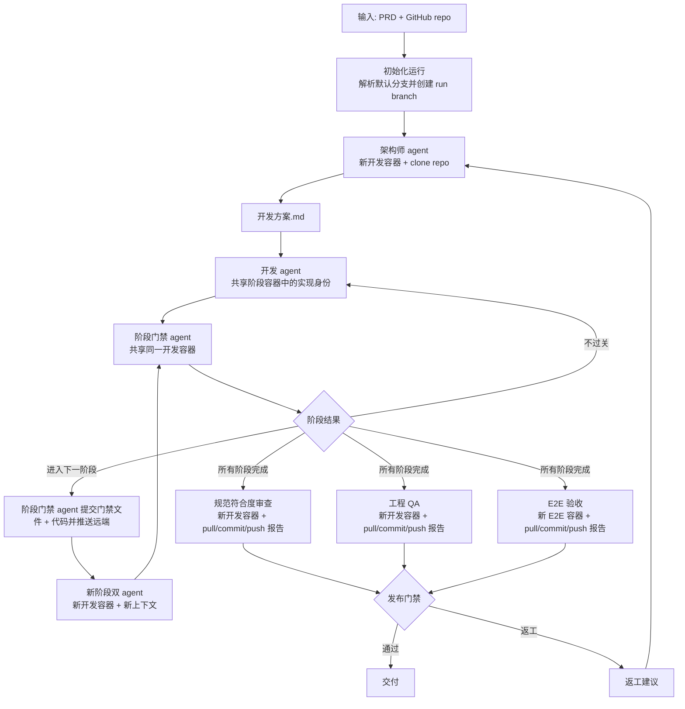

# V1 Runtime Architecture

## 目标

`v1` 的目标不是一次性做出最终自治系统，而是先跑通一个可重复执行的最小闭环：

- 输入只有两项：`PRD` 和 `GitHub 仓库地址`
- 不再单独设置 `PRD 专员`
- 所有执行型 agent 都在 `Docker` 容器中运行；同一开发阶段内，`开发 agent` 与 `阶段门禁 agent` 共享同一个开发容器
- 代码仓库以 `GitHub` 远端为单一事实来源
- 阶段门禁本身也是一个 agent；它共享开发容器，但不允许修改代码，且只有它能在通过时提交并推送远端
- 发布门禁失败后，不复用旧容器和旧 agent 上下文，而是重新规划并重新执行

---

## 框架选择

`v1` 推荐采用两层架构：

- 顶层编排使用 `LangGraph`
- 具体干活的角色 agent 使用 `Deep Agents`

原因很直接：

- 你的核心难点是多阶段状态流转、门禁判断、失败回环、上下文重置
- 这些都属于显式工作流和持久化状态管理，更适合放在 `LangGraph`
- `架构师 agent`、`开发 agent`、`阶段门禁 agent`、后续可能扩展的 `QA agent` 都适合放在 `Deep Agents`

换句话说，`LangGraph` 负责“流程和状态”，`Deep Agents` 负责“进入容器以后如何完成工作”。

---

## V1 输入

每次运行只要求用户提供：

- `prd_markdown`
- `github_repo_url`

`v1` 默认再做两个自动推断：

- `base_branch`：取仓库默认分支
- `run_branch`：由系统为本次执行创建一条独立工作分支

这里建议 `v1` 默认使用独立工作分支，而不是直接往 `main` 提交。这样可以保持自动化，又能明显降低误写主分支的风险。

---

## 预制容器

`v1` 只准备两类基础容器镜像。

### 1. 开发容器

用途：

- `架构师 agent`
- `开发 agent`
- `阶段门禁 agent`
- `规范符合度审查`
- `工程 QA`

最小预装：

- `git`
- `bun`
- 常见 shell 工具

建议额外预装：

- `python3`
- `node`
- 编译常用依赖所需的基础系统包

### 2. E2E 容器

用途：

- `E2E 验收`

最小预装：

- 开发容器全部能力
- 浏览器运行环境
- `Playwright`

---

## Git 约束

`v1` 的 git 规则建议固定如下：

- 每次运行先从远端默认分支拉起一条 `run_branch`
- 所有工作容器都从同一条 `run_branch` 克隆代码
- 所有运行输入、规划文档、门禁结论、测试报告、返工建议都必须落在仓库内，并由 git 跟踪
- `架构师 agent` 只能写规划类工件，并且需要把这些工件提交到 `run_branch`
- `开发 agent` 与 `阶段门禁 agent` 在同一阶段共享同一个开发容器和同一个工作区
- `阶段门禁 agent` 可以读取代码、运行命令、执行测试、检查 diff，并承担审查与放行职责
- `阶段门禁 agent` 不允许修改源代码和业务文件，但允许写入自己负责的阶段门禁工件
- `开发 agent` 负责改代码，`阶段门禁 agent` 负责提交当前阶段代码与门禁工件
- 三路验证 agent 只允许写各自独占的报告路径，并各自提交
- `发布门禁` 不直接重写历史，只决定“交付成功”还是“回流重做”

这样做有两个好处：

- 提交责任集中，便于审计
- 阶段推进和 git 状态严格对齐，不会出现“阶段过了但远端代码没落地”

---

## 仓库内工件规范

`v1` 改成“所有文件完全由 git 管理保存”。也就是说：

- 不再依赖容器外的宿主机工件目录
- 所有输入、规划、审查、测试、发布、返工文件都直接写进仓库
- 只要文件生成完成，就应该按职责尽快提交到 `run_branch`

为了支撑你说的“三重循环”，建议把控制工件全部收敛到仓库内固定目录：

```text
.autogen/runs/<run_id>/
  00-input/
    prd.md
    run.json
  10-planning/
    cycle-001/
      architecture-plan.md
      e2e-plan.md
  20-stages/
    stage-001/
      attempt-001/
        gate-decision.md
      attempt-002/
        gate-decision.md
    stage-002/
      attempt-001/
        gate-decision.md
  30-reviews/
    release-001/
      compliance/report.md
      qa/report.md
      e2e/report.md
  40-release/
    release-001/
      decision.md
  50-rework/
    release-001/
      rework-summary.md
```

普通业务代码仍然留在仓库原本的源代码目录里；`.autogen/runs/<run_id>/` 只承载流程控制工件和审计记录。

### 三重循环与文件归属

推荐把系统理解成三个循环，并给每个循环固定写入区域：

- 规划循环：`00-input/` 与 `10-planning/`
- 阶段循环：`20-stages/`
- 发布循环：`30-reviews/`、`40-release/`、`50-rework/`

这样做的好处是：

- 每个 agent 的写集合清晰
- 并行阶段尽量避免写同一个文件
- 即使容器销毁，所有产物也已经进入仓库历史

### agent 写权限建议

- `架构师 agent`：只写 `00-input/` 和 `10-planning/`
- `开发 agent`：只改业务代码、测试代码、构建配置，以及必要的实现文件
- `阶段门禁 agent`：只写 `20-stages/.../gate-decision.md`，不能改业务代码
- `规范符合度审查`：只写 `30-reviews/.../compliance/report.md`
- `工程 QA`：只写 `30-reviews/.../qa/report.md`
- `E2E 验收`：只写 `30-reviews/.../e2e/report.md`
- `发布门禁`：只写 `40-release/.../decision.md`，失败时额外写 `50-rework/.../rework-summary.md`

### git 提交规则

- `架构师 agent` 生成规划工件后，直接提交并推送
- `阶段门禁 agent` 每次给出阶段结论时，都提交对应的 `gate-decision.md`
- 如果阶段通过，`阶段门禁 agent` 在同一次提交里一并提交当前阶段代码改动
- 三路验证 agent 各自提交自己的报告文件，不改别人的报告路径
- `发布门禁` 在收齐三路报告后，提交发布结论；如果失败，再把返工建议一并提交

### 三路并发的 pull / push 规则

三路验证虽然并发执行，但提交时必须串行吸收远端最新状态。推荐固定流程：

1. agent 只生成自己负责路径下的报告文件
2. 提交前执行 `git pull --rebase --autostash origin <run_branch>`
3. 只 `git add` 自己负责的报告路径
4. `git commit`
5. `git push origin <run_branch>`

因为三路报告的落点是完全分开的，正常情况下只要遵守固定路径规范，`pull --rebase` 不应该产生业务冲突。

---

## 容器与上下文生命周期

这是 `v1` 最关键的运行约束。

### 架构师 agent

- 启动时新建一个开发容器
- 在容器中克隆 `run_branch`
- 把 `PRD` 与当前仓库代码一起作为输入
- 把 `PRD` 落盘到 `.autogen/runs/<run_id>/00-input/prd.md`
- 输出规划文件到 `.autogen/runs/<run_id>/10-planning/cycle-<n>/`
- 提交并推送这次规划产生的工件
- 结束后该容器可以直接销毁

`架构师 agent` 不需要长时间持有容器状态，因为它的核心产物已经直接写进仓库并提交到了远端分支。

### 阶段内双 agent 模式

从 `v1` 开始，每个开发阶段都不是“一个开发 agent + 一个容器”，而是：

- 一个共享的开发容器
- 一个 `开发 agent` 身份
- 一个 `阶段门禁 agent` 身份

这两个 agent：

- 使用同一个仓库副本
- 看到同一个工作区状态
- 共享同一个执行环境
- 角色和权限不同：`开发 agent` 负责实现，`阶段门禁 agent` 负责审查、放行、提交，但不能改代码

也就是说，`阶段门禁 agent` 不是容器外的裁判，而是进入同一个开发现场、直接检查同一份工作区的独立身份。

### 开发 agent

- 每个阶段开始时，新建一个开发容器
- 在容器中克隆当前最新的 `run_branch`
- 新建一个开发 agent 上下文，只输入本阶段所需上下文
- 同时新建一个阶段门禁 agent 上下文，绑定到同一个开发容器
- 在当前阶段内，开发容器、开发 agent 上下文、阶段门禁 agent 上下文都保持不变

### 阶段门禁 agent

- 与 `开发 agent` 共用同一个开发容器
- 拥有与 `开发 agent` 接近的观测与执行能力，可以读代码、跑命令、做测试、看仓库状态
- 只允许写入 `.autogen/runs/<run_id>/20-stages/.../gate-decision.md`
- 不允许修改源代码、测试代码或其他业务工件
- 负责评估当前阶段是否不过关、进入下一阶段、或全部完成
- 每次得出阶段结论时，都负责提交对应的门禁工件
- 在判定可以进入下一阶段时，由它负责把门禁工件与当前阶段代码一起提交并推送

如果阶段门禁 agent 认为当前阶段需要修正，它只能输出问题和建议，再交回 `开发 agent` 在同一个共享容器里继续修改。

如果 `阶段门禁` 判定“本阶段不过关”：

- `阶段门禁 agent` 先提交本次 `gate-decision.md`
- 继续复用同一个开发 agent 上下文
- 继续复用同一个阶段门禁 agent 上下文
- 继续复用同一个开发容器
- 在原有工作区基础上迭代，不重新克隆

如果 `阶段门禁` 判定“进入下一阶段”：

- `阶段门禁 agent` 负责提交并推送当前阶段结果到远端
- 销毁当前开发 agent 上下文
- 销毁当前阶段门禁 agent 上下文
- 销毁当前开发容器
- 为下一阶段重新创建新的开发 agent 上下文、新的阶段门禁 agent 上下文和新的开发容器
- 新容器从最新远端状态重新克隆 `run_branch`

这条规则很重要，因为它保证：

- 阶段内允许连续修补，保持工作连续性
- 阶段间强制重新收敛上下文，避免历史噪音不断累积

### 三路验证

在“所有阶段完成”后，启动三路独立验证：

- `规范符合度审查`：新建开发容器
- `工程 QA`：新建开发容器
- `E2E 验收`：新建 E2E 容器

三路验证都从远端最新 `run_branch` 重新克隆，不共享开发阶段容器。

三路验证的输出文件必须固定在下面三个互不重叠的路径：

- `.autogen/runs/<run_id>/30-reviews/release-<n>/compliance/report.md`
- `.autogen/runs/<run_id>/30-reviews/release-<n>/qa/report.md`
- `.autogen/runs/<run_id>/30-reviews/release-<n>/e2e/report.md`

每一路在提交自己的报告前，都必须先执行 `git pull --rebase --autostash origin <run_branch>`，然后再提交并推送自己的报告文件。

这样可以确保验证结果针对的是“已提交的候选版本”，而不是某个开发容器里的未提交状态。

### 发布门禁失败

如果发布门禁判定需要返工：

- 生成 `40-release/.../decision.md`
- 生成 `50-rework/.../rework-summary.md`
- 把这两个文件提交并推送到远端
- 清理前面所有 agent 上下文
- 清理前面所有容器
- 从远端当前最新提交重新开始
- 重新调用 `架构师 agent`

这里不要复用旧上下文。因为发布失败后，问题已经从“局部实现缺陷”升级为“规划与实现闭环需要重新整理”。

---

## 顶层工作流

下面是更贴近 `v1` 的顶层状态机：



---

## LangGraph 顶层状态建议

`LangGraph` 顶层 state 建议至少包含这些字段：

- `run_id`
- `prd_content`
- `github_repo_url`
- `base_branch`
- `run_branch`
- `head_sha`
- `artifact_root_path`
- `planning_cycle`
- `plan_path`
- `e2e_plan_path`
- `stages`
- `current_stage_index`
- `current_stage_attempt`
- `stage_gate_result`
- `current_stage_gate_path`
- `release_cycle`
- `release_gate_result`
- `architect_container_id`
- `developer_container_id`
- `developer_thread_id`
- `stage_gate_thread_id`
- `compliance_report_path`
- `qa_report_path`
- `e2e_report_path`
- `rework_summary_path`

这里最重要的不是字段多少，而是把下面几类信息分开存：

- 远端 git 状态
- 当前阶段信息
- 当前活跃容器和 agent 会话标识
- 各门禁产物

---

## 节点职责建议

`v1` 可以先把顶层节点收敛成下面这些：

- `initialize_run`
- `run_architect`
- `run_developer_for_current_stage`
- `run_stage_gate_agent`
- `apply_stage_gate_decision`
- `run_compliance_review`
- `run_engineering_qa`
- `run_e2e_validation`
- `evaluate_release_gate`
- `prepare_rework_packet`
- `reset_for_replan`

其中有两个边界要尽量守住：

- 顶层节点负责容器创建、上下文重置、状态迁移
- 容器里的 agent 只负责完成分配给它的任务

不要让 agent 自己决定什么时候重置上下文，也不要让容器内部逻辑直接修改顶层流程状态。
不要让 `阶段门禁 agent` 直接修代码，否则“审查者”和“实现者”的责任边界会变模糊。
不要让多个并发验证 agent 写同一个报告文件，否则 `git pull --rebase` 会变成常态冲突源。

---

## V1 明确不做的事

为了先把闭环跑起来，`v1` 建议先不做这些扩展：

- 不做 `PRD 专员`
- 不做人工审批分支
- 不做多仓库协同
- 不做多个开发 agent 并行修改同一仓库
- 不做复杂环境推断和自动镜像定制
- 不做直接推送主分支

---

## 最小落地顺序

如果按实现顺序推进，建议先做：

1. `LangGraph` 顶层 state 和节点骨架
2. 容器创建与销毁接口
3. GitHub clone / branch / push 能力
4. `架构师 agent` 执行器
5. `开发 agent` 执行器
6. `阶段门禁` 决策与提交逻辑
7. 三路验证执行器
8. `发布门禁` 与返工回流

这样可以先验证“流转机制”是否成立，再逐步增强 agent 质量。

---

## 一句话原则

`v1` 的核心原则可以压缩成一句话：

所有控制工件都直接写进仓库并提交；同一阶段内复用共享开发容器，以及绑定其上的开发 agent / 阶段门禁 agent 两个上下文；跨阶段、跨发布回流一律从远端最新提交重新开始。
