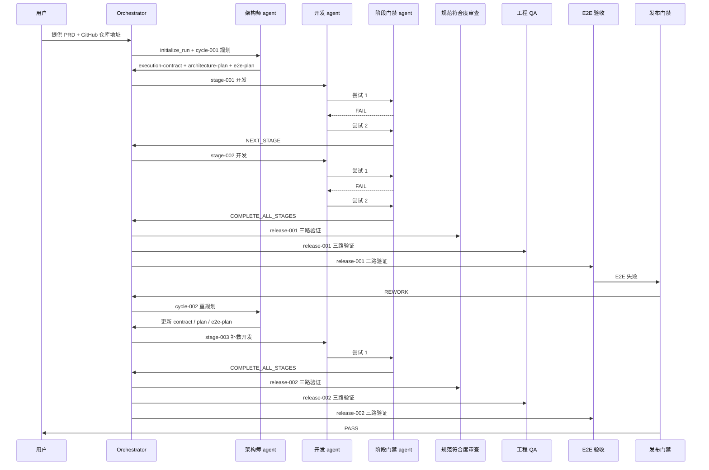

# V1 模拟运行流程

> 这是一份“状态机分支全覆盖”的模拟运行文档。
> 它把两件事同时说清楚：
> 1. Git 侧始终只有一条本次运行专用的 `run_branch`
> 2. 流程侧会走过阶段门禁和发布门禁的所有关键状态分支

## 1. 先约定两个不同层面的“分支”

### Git 分支

Git 这里只保留一条本次运行专用的工作分支，例如：

```text
autogen/run-2026-04-06-090000-demo
```

整次运行期间，规划工件、门禁工件、审查报告、发布结论和业务代码都落在这一条 `run_branch` 上。

### 流程状态机分支

这里说的“所有分支都走到过”，指的是流程状态机里的分支，而不是 Git 分支。

本例会覆盖这些状态分支：

- 阶段门禁：`不过关`
- 阶段门禁：`进入下一阶段`
- 阶段门禁：`所有阶段完成`
- 发布门禁：`返工`
- 发布门禁：`通过`

## 2. 这个例子里谁是基线

这里有一个非常关键的口径约定：

- `prd.md`：保存原始输入，用于审计、回放和回流重规划时参考
- `execution-contract.md`：冻结后的统一执行口径，是后续开发、规范审查、E2E 验收和发布门禁共享的基线

也就是说，后续 agent 不是各自直接自由解释 `prd.md`，而是对齐同一个 `execution-contract.md`。

## 3. 例子设定

### 用户给系统的 PRD

```md
给现有任务管理 Web 应用增加标签系统。用户可以给任务打标签、按标签筛选、刷新页面后保留筛选条件，并补齐 Playwright 验收测试。
```

### 系统输入

- `prd_markdown`
- `github_repo_url`

### 本次运行的自动推断结果

- `run_id = run-2026-04-06-090000-demo`
- `base_branch = main`
- `run_branch = autogen/run-2026-04-06-090000-demo`

### `.autogen` 的根目录

```text
.autogen/runs/run-2026-04-06-090000-demo/
```

### 示例仓库假设

- 目标仓库是一个已有的任务管理 Web 应用
- 仓库已经具备前后端改动所需的工具链
- 这个例子允许在同一仓库里同时修改数据模型、API、前端页面和 Playwright 测试

如果某个真实目标仓库是纯前端仓库，那么阶段拆分会跟着仓库能力调整，但流程状态机本身不变。

## 4. 一眼看懂的总流程



## 5. 详细模拟时间线

### Step 0. `initialize_run`

顶层编排器先做初始化：

1. 读取远端仓库默认分支，得到 `main`
2. 生成 `run_id`
3. 创建本次运行专用的 `run_branch`
4. 记录运行元信息

最先出现的工件是：

```text
.autogen/runs/run-2026-04-06-090000-demo/00-input/prd.md
.autogen/runs/run-2026-04-06-090000-demo/00-input/run.json
```

这两个文件的职责是：

- `prd.md`：冻结原始输入
- `run.json`：记录 `run_id`、仓库地址、`base_branch`、`run_branch`、创建时间等元信息

这一步只是建立运行轨道，不进入开发。

### Step 1. 第一次规划，生成 `cycle-001`

系统启动第一个架构师容器：

- 容器：`architect-container-1`
- clone 分支：`autogen/run-2026-04-06-090000-demo`

它读取：

- `.autogen/runs/run-2026-04-06-090000-demo/00-input/prd.md`
- 当前仓库代码
- 当前测试结构

然后产出：

```text
.autogen/runs/run-2026-04-06-090000-demo/10-planning/cycle-001/execution-contract.md
.autogen/runs/run-2026-04-06-090000-demo/10-planning/cycle-001/architecture-plan.md
.autogen/runs/run-2026-04-06-090000-demo/10-planning/cycle-001/e2e-plan.md
```

#### `execution-contract.md` 在这轮冻结的口径

- 支持给任务打标签
- 支持按标签筛选任务
- 刷新页面后恢复筛选条件
- 补齐 Playwright 验收测试
- 前后端字段、状态恢复行为和验收标准要明确

#### `architecture-plan.md` 的阶段拆分

- `stage-001`：标签模型、数据库迁移、API、单测
- `stage-002`：前端筛选 UI、筛选状态持久化、E2E 关联修补

#### `e2e-plan.md` 的关键场景

- 添加标签并在列表中显示
- 按标签筛选任务
- 刷新页面后恢复筛选条件
- Playwright 在目标浏览器矩阵中覆盖关键路径

架构师把 `00-input` 和 `cycle-001` 工件提交到 `run_branch`，然后销毁自己的容器。

从这一刻开始，后续角色主要对齐的是 `execution-contract.md`，而不是重新自由解释 `prd.md`。

### Step 2. `stage-001` 第一次尝试，走到“不过关”

系统创建第一个阶段开发容器：

- 容器：`dev-container-stage-001`
- 身份 1：`开发 agent`
- 身份 2：`阶段门禁 agent`

这两个身份共享同一个容器、同一个工作区、同一个仓库副本，但职责不同：

- `开发 agent` 改业务代码
- `阶段门禁 agent` 审查、跑测试、写门禁结论、决定是否放行

开发 agent 的第一版实现包含：

- 标签表模型
- 任务标签关联 API
- 部分单测

阶段门禁 agent 检查后发现：

- 数据库迁移文件缺失
- API 单测只覆盖成功路径，没有覆盖空标签和重复标签场景

它判定：

```text
FAIL
```

并写入：

```text
.autogen/runs/run-2026-04-06-090000-demo/20-stages/stage-001/attempt-001/gate-decision.md
```

这个 `gate-decision.md` 会记录：

- 当前阶段：`stage-001`
- 当前尝试：`attempt-001`
- 结论：`FAIL`
- 证据：执行过的检查和失败点
- 修正建议：补迁移、补测试

然后阶段门禁 agent 只提交这个门禁文件，不提交业务代码。

这一步很关键：

- 业务代码改动仍留在共享容器里
- 当前容器不销毁
- 当前开发上下文不销毁
- 当前门禁上下文不销毁

也就是“阶段失败时，留在同一开发现场继续修”。

### Step 3. `stage-001` 第二次尝试，走到“进入下一阶段”

开发 agent 继续在 `dev-container-stage-001` 原地修：

- 加数据库迁移
- 补重复标签校验
- 补测试

阶段门禁 agent 再检查一遍，确认 `stage-001` 的退出条件已满足，于是写：

```text
.autogen/runs/run-2026-04-06-090000-demo/20-stages/stage-001/attempt-002/gate-decision.md
```

这次结论是：

```text
NEXT_STAGE
```

然后它做两件事：

1. 把 `attempt-002/gate-decision.md` 加入提交
2. 把本阶段通过的业务代码改动一起提交并推送到 `run_branch`

提交后：

- `dev-container-stage-001` 销毁
- `stage-001` 的开发上下文销毁
- `stage-001` 的门禁上下文销毁

这一步对应的状态机分支是：

- 阶段门禁：`进入下一阶段`

### Step 4. `stage-002` 第一次尝试，再次走到“不过关”

系统创建新的阶段开发容器：

- 容器：`dev-container-stage-002`
- clone 分支：远端最新 `run_branch`

开发 agent 开始做前端部分：

- 添加标签筛选面板
- 添加筛选逻辑
- 初步接上前后端 API

阶段门禁 agent 检查后发现：

- 刷新后筛选状态没有恢复，不满足冻结合同
- 相关 Playwright 用例没有补
- 本地状态初始化时存在 race condition 风险

于是它写：

```text
.autogen/runs/run-2026-04-06-090000-demo/20-stages/stage-002/attempt-001/gate-decision.md
```

结论 again 是：

```text
FAIL
```

和前一次阶段失败一样：

- 它只提交门禁文件
- 不提交业务代码
- 开发 agent 继续在同一个容器里修

### Step 5. `stage-002` 第二次尝试，走到“所有阶段完成”

开发 agent 继续修：

- 把筛选条件持久化到本地存储
- 页面初始化时恢复筛选状态
- 增补 Playwright 测试脚本
- 调整交互细节

阶段门禁 agent 再审一次，发现：

- 这已经是 `cycle-001` 里的最后一个规划阶段
- 当前阶段退出条件满足

于是它写：

```text
.autogen/runs/run-2026-04-06-090000-demo/20-stages/stage-002/attempt-002/gate-decision.md
```

这次结论是：

```text
COMPLETE_ALL_STAGES
```

然后它把两类内容一起提交并推送：

- `attempt-002/gate-decision.md`
- 当前阶段所有业务代码改动

到这里，首轮阶段循环结束。

你会看到，阶段门禁的三个状态分支都已经走到过：

- `不过关`：`stage-001/attempt-001`
- `进入下一阶段`：`stage-001/attempt-002`
- `所有阶段完成`：`stage-002/attempt-002`

### Step 6. `release-001` 的三路验证并发启动

现在系统启动三路独立验证。

这三路有两个共同规则：

- 都不复用刚才的开发容器
- 都从远端最新 `run_branch` 重新 clone

同时三路都要显式读取同一个：

- `.autogen/runs/run-2026-04-06-090000-demo/10-planning/cycle-001/execution-contract.md`

其中 E2E 还会额外读取：

- `.autogen/runs/run-2026-04-06-090000-demo/10-planning/cycle-001/e2e-plan.md`

#### 6.1 规范符合度审查

它检查“是否做了、是否做全了、是否与合同一致”，然后写：

```text
.autogen/runs/run-2026-04-06-090000-demo/30-reviews/release-001/compliance/report.md
```

假设这一路结论是通过。

#### 6.2 工程 QA

它跑：

- `lint`
- `typecheck`
- 单元测试
- 失败归因

然后写：

```text
.autogen/runs/run-2026-04-06-090000-demo/30-reviews/release-001/qa/report.md
```

假设这一路也通过，只带一点不阻塞的备注。

#### 6.3 E2E 验收

它在独立的 E2E 容器里跑 Playwright，写：

```text
.autogen/runs/run-2026-04-06-090000-demo/30-reviews/release-001/e2e/report.md
```

这次假设发现一个真实问题：

- Chromium 下通过
- WebKit 下刷新页面后，筛选状态偶发不恢复
- 根因是 hydration 和本地存储恢复顺序存在竞争

所以这一路结论是失败。

#### 三路验证各自的 Git 规则

虽然三路是并发跑的，但每一路在提交报告前都必须做同样的事情：

1. `git pull --rebase --autostash origin autogen/run-2026-04-06-090000-demo`
2. 只 `git add` 自己那一路的报告文件
3. `git commit`
4. `git push`

这样三路验证不会互相覆盖，也不会去碰别人的报告路径。

### Step 7. 第一次发布门禁，走到“返工”

发布门禁读取：

- `release-001/compliance/report.md`
- `release-001/qa/report.md`
- `release-001/e2e/report.md`
- `cycle-001/execution-contract.md`

它看到：

- compliance：通过
- qa：通过
- e2e：失败

所以总体不能发布。

它会写两个文件：

```text
.autogen/runs/run-2026-04-06-090000-demo/40-release/release-001/decision.md
.autogen/runs/run-2026-04-06-090000-demo/50-rework/release-001/rework-summary.md
```

这两个文件职责不同：

- `decision.md`：正式发布裁决，这次结论是不通过
- `rework-summary.md`：把失败原因整理成下一轮规划输入

这一步之后，系统会：

- 销毁所有旧开发容器
- 销毁所有旧验证容器
- 销毁所有旧 agent 上下文
- 不在旧容器上继续打补丁
- 从远端最新提交重新开始规划

这一步对应的状态机分支是：

- 发布门禁：`返工`

### Step 8. 第二次规划，生成 `cycle-002`

系统重新启动一个新的架构师容器：

- 容器：`architect-container-2`

这次它的输入不只是原始 PRD 和当前代码，还会特别读取：

```text
.autogen/runs/run-2026-04-06-090000-demo/50-rework/release-001/rework-summary.md
```

也就是说，第二轮规划不是盲目重来，而是“带着失败教训重规划”。

它产出：

```text
.autogen/runs/run-2026-04-06-090000-demo/10-planning/cycle-002/execution-contract.md
.autogen/runs/run-2026-04-06-090000-demo/10-planning/cycle-002/architecture-plan.md
.autogen/runs/run-2026-04-06-090000-demo/10-planning/cycle-002/e2e-plan.md
```

这一轮会把合同进一步收紧，例如明确：

- 刷新后筛选条件恢复是必达项
- 跨浏览器恢复行为要一致
- hydration 完成前不能让错误的初始筛选状态抢先渲染

第二轮计划只拆一个补救阶段：

- `stage-003`：修 hydration 顺序问题，强化恢复逻辑，补跨浏览器 E2E 稳定性

然后架构师提交并推送 `cycle-002`。

### Step 9. `stage-003` 补救开发，直接走到“所有阶段完成”

系统创建新的阶段开发容器：

- 容器：`dev-container-stage-003`
- clone 分支：远端最新 `run_branch`

开发 agent 实现：

- 延后 UI 渲染到筛选状态恢复之后
- 在初始化阶段增加显式等待
- 修正 Playwright 等待条件
- 补 WebKit 针对性回归

阶段门禁 agent 检查后认为：

- 这是 `cycle-002` 中唯一的规划阶段
- 所有退出条件都已满足

于是写：

```text
.autogen/runs/run-2026-04-06-090000-demo/20-stages/stage-003/attempt-001/gate-decision.md
```

结论：

```text
COMPLETE_ALL_STAGES
```

然后它提交：

- 本阶段业务代码
- 这个门禁文件

并推送到远端。

### Step 10. `release-002` 的三路验证，全部通过

系统再次启动三路验证，这次输出落在：

```text
.autogen/runs/run-2026-04-06-090000-demo/30-reviews/release-002/compliance/report.md
.autogen/runs/run-2026-04-06-090000-demo/30-reviews/release-002/qa/report.md
.autogen/runs/run-2026-04-06-090000-demo/30-reviews/release-002/e2e/report.md
```

这次假设：

- compliance：通过
- qa：通过
- e2e：通过

每一路照样：

1. `git pull --rebase --autostash`
2. 只提交自己那一路报告
3. 推送到同一条 `run_branch`

### Step 11. 第二次发布门禁，走到“通过”

发布门禁聚合第二轮三份报告，确认全部通过，于是写：

```text
.autogen/runs/run-2026-04-06-090000-demo/40-release/release-002/decision.md
```

这次结论是：

```text
PASS
```

然后提交并推送，运行结束，交付成功。

到这里，发布门禁的两个状态分支也都走过了：

- `返工`：`release-001`
- `通过`：`release-002`

## 6. 最后仓库里的 `.autogen` 大概长这样

```text
.autogen/
  runs/
    run-2026-04-06-090000-demo/
      00-input/
        prd.md
        run.json
      10-planning/
        cycle-001/
          execution-contract.md
          architecture-plan.md
          e2e-plan.md
        cycle-002/
          execution-contract.md
          architecture-plan.md
          e2e-plan.md
      20-stages/
        stage-001/
          attempt-001/
            gate-decision.md
          attempt-002/
            gate-decision.md
        stage-002/
          attempt-001/
            gate-decision.md
          attempt-002/
            gate-decision.md
        stage-003/
          attempt-001/
            gate-decision.md
      30-reviews/
        release-001/
          compliance/
            report.md
          qa/
            report.md
          e2e/
            report.md
        release-002/
          compliance/
            report.md
          qa/
            report.md
          e2e/
            report.md
      40-release/
        release-001/
          decision.md
        release-002/
          decision.md
      50-rework/
        release-001/
          rework-summary.md
```

这个结构里最重要的一点是：

- `.autogen` 存的是流程控制工件和审计记录
- 真正的应用代码仍然在原来的 `src/`、`app/`、`tests/` 等目录里

## 7. `.autogen` 到底怎么用

`.autogen` 不是一个被动日志目录，它至少承担了 4 个角色：

- 输入冻结区：`00-input` 固定本次运行起点
- 流程控制面：编排器读取 `10-planning`、`20-stages`、`40-release` 决定接下来跑什么
- 跨容器记忆体：容器可以销毁，但新容器 clone 下来后能从仓库中的工件接上上下文
- 审计轨迹：可以回看哪一轮规划失败、哪一条 E2E 报告拦住发布、返工是如何收敛的

## 8. 每类目录的真实职责

- `00-input`：保存原始事实，通常不改
- `10-planning`：按 `cycle-nnn` 记录每轮规划，不覆盖旧版本
- `20-stages`：按 `stage-nnn/attempt-nnn` 记录阶段门禁结论
- `30-reviews`：按 `release-nnn` 保存候选版本的三路验证证据
- `40-release`：保存正式发布裁决
- `50-rework`：只在发布失败时出现，作为下一轮规划的直接输入

## 9. 一个特别容易混淆但很重要的点

阶段失败和发布失败不是同一个层级的问题。

### 阶段失败

`20-stages` 记录的是：

- 这一次为什么没过
- 在同一阶段里还需要补什么

所以阶段失败时：

- 复用同一个开发容器
- 复用同一个开发上下文
- 复用同一个门禁上下文
- 在原工作区继续修

### 发布失败

`50-rework` 记录的是：

- 为什么整个候选版本不能发
- 下一轮应该如何重新规划

所以发布失败时：

- 销毁旧容器
- 销毁旧上下文
- 从远端最新状态重新开始规划

这就是为什么：

- `20-stages` 解决的是局部实现闭环
- `50-rework` 解决的是全局闭环重启

## 10. 这个例子证明了什么

这个例子完整覆盖了 `v1` 里最关键的流程状态分支：

- 阶段门禁：`FAIL`
- 阶段门禁：`NEXT_STAGE`
- 阶段门禁：`COMPLETE_ALL_STAGES`
- 发布门禁：`REWORK`
- 发布门禁：`PASS`

同时它也体现了 `v1` 的几个核心原则：

- Git 侧只有一条 `run_branch`
- 所有控制工件都进仓库
- 阶段内允许连续修补
- 阶段间强制重置上下文
- 三路验证针对的是已提交候选版本
- 发布失败后必须带着 `rework-summary.md` 重新规划

## 11. 一句话总结

如果把这套 `v1` 编排真的跑起来，它不会像“一个 agent 从头干到尾”，而更像一条带审计能力的自动化研发流水线：

- 先冻结输入
- 再冻结执行合同
- 按阶段实现
- 每阶段有门禁
- 所有阶段完成后做三路验证
- 发布失败就生成返工包并重新规划
- 所有过程证据都写回同一条 `run_branch`
